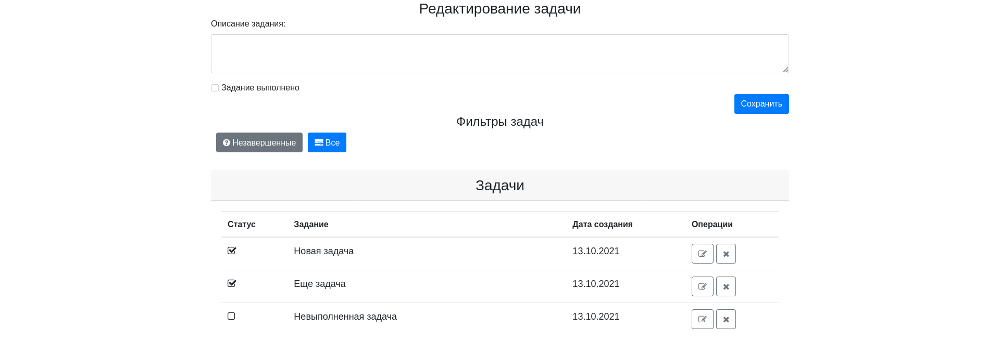
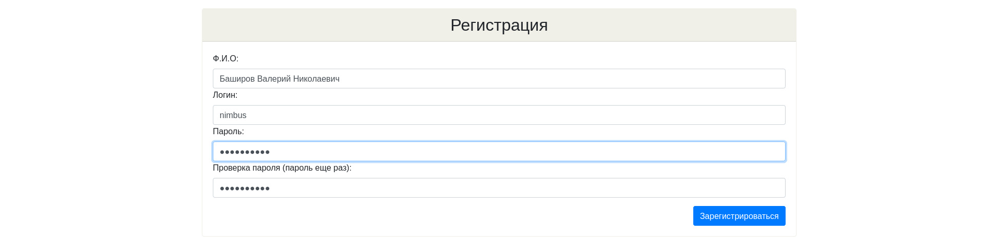
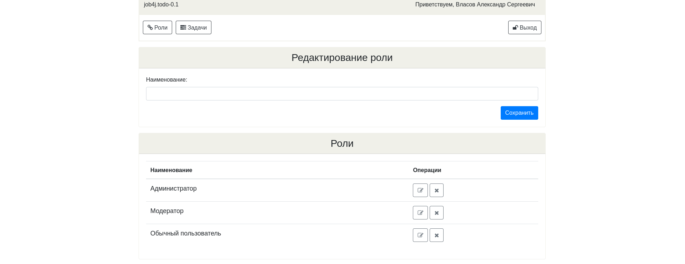

## Описание ##
Это учебный проект информационной системы учета дел или заданий.

Авторизованному пользователю доступны все операции над заданиями: создание, просмотр, редактирование и удаление.

Неавторизованный пользователь может только просматривать задания и роли. 
#### Технологии проекта ####

## Скриншоты ##
#### Список заданий ####

#### Форма авторизации ####

#### Форма регистрации ####

#### Список ролей ####
