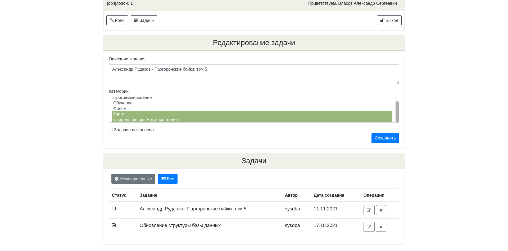

## Описание ##
Это учебный проект простого одностраничного приложения - информационной системы учета дел или заданий.
Пользователю доступны все операции над заданиями: создание, просмотр, редактирование и удаление. 
#### Технологии проекта ####

## Скриншоты ##
#### Главная страница ####

